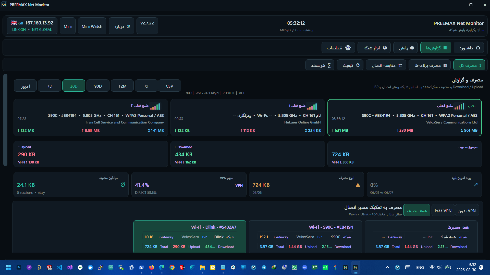

# PREEMAX NetMonitor

<p align="center">
  <strong>مانیتورینگ، گزارش‌گیری و عیب‌یابی شبکه برای Windows</strong>
</p>

<p align="center">
  
  
  
  
</p>

**PREEMAX NetMonitor** یک نرم‌افزار مانیتورینگ و تحلیل شبکه برای Windows است که تلاش می‌کند اطلاعات پراکنده‌ای مثل وضعیت اینترنت، Public IP، VPN، مصرف داده، کیفیت اتصال، برنامه‌های مصرف‌کننده اینترنت، DNS و وضعیت سایت‌ها و سرویس‌ها را در یک محیط یکپارچه جمع کند.

هدف برنامه فقط نمایش سرعت لحظه‌ای نیست؛ NetMonitor برای **ثبت تاریخچه، تفکیک مصرف، مقایسه اتصال‌ها، تشخیص تغییرات و تولید گزارش قابل استفاده در طول زمان** طراحی شده است.

> **Publisher:** PREEMAX / ماناکاوش  
> **Website:** https://preemax.ir

---

## نمایی از برنامه

<p align="center">
  
</p>

> تصاویر رابط کاربری برای معرفی قابلیت‌های برنامه هستند. مقادیر مصرف، IP، نام شبکه، نام سرویس یا سایر داده‌های داخل تصاویر ممکن است داده تست/نمونه باشند و نباید به‌عنوان آمار ثابت محصول در نظر گرفته شوند.

---

# NetMonitor چه کاری انجام می‌دهد؟

## 1. ثبت و محاسبه مصرف اینترنت با تفکیک واقعی مسیر اتصال

یکی از بخش‌های اصلی NetMonitor، ثبت Download و Upload در طول زمان است. برنامه فقط یک عدد کلی از مصرف اینترنت نشان نمی‌دهد و داده‌ها را با چند مبنا قابل تفکیک نگه می‌دارد.

امکان بررسی مصرف بر اساس مواردی مانند:

- Download
- Upload
- مجموع مصرف
- مصرف با **VPN روشن**
- مصرف با **VPN خاموش / اتصال مستقیم**
- نوع اتصال مانند `Wi‑Fi / Ethernet / USB Tethering / Bluetooth`
- پایه یا منبع اتصال
- SSIDهای مختلف Wi‑Fi
- بازه‌های روزانه، هفتگی، ماهانه و بازه سفارشی

این ساختار کمک می‌کند مشخص شود مثلاً چه مقدار از حجم اینترنت روی یک Wi‑Fi خاص مصرف شده، چه مقدار هنگام استفاده از VPN بوده و چه مقدار از مسیر مستقیم عبور کرده است.

### شناسایی منبع اتصال

در Wi‑Fi، نام شبکه یا SSID یکی از مبناهای اصلی گزارش است. علاوه بر آن، اطلاعات فنی قابل شناسایی Wi‑Fi مانند Band، Channel و نوع Security در بخش‌های مرتبط شبکه استفاده می‌شوند.

برای اتصال‌های دیگر نیز برنامه بین مسیرهایی مانند Ethernet، اینترنت موبایل از طریق USB Tethering و سایر واسط‌های شبکه تفاوت قائل می‌شود تا همه اتصال‌ها زیر یک عنوان تکراری جمع نشوند.

---

## 2. آمار مصرف روزانه، هفتگی و ماهانه

NetMonitor تاریخچه مصرف را نگهداری می‌کند تا کاربر فقط وضعیت همین لحظه را نبیند.

گزارش‌ها برای بررسی روند مصرف در بازه‌های مختلف طراحی شده‌اند و می‌توانند شامل:

- امروز
- چند روز گذشته
- هفته جاری
- ماه جاری
- بازه‌های 7D، 30D، 90D و 12M
- بازه سفارشی

باشند.

در گزارش مصرف می‌توان Download، Upload و مجموع مصرف را بررسی کرد و داده را بر اساس مسیر اتصال، نوع اتصال و وضعیت VPN فیلتر یا مقایسه کرد.

خروجی `CSV` نیز در بخش‌های گزارش برای استفاده خارج از برنامه در نظر گرفته شده است.

---

## 3. تشخیص مصرف VPN و اتصال مستقیم

NetMonitor وضعیت VPN را فقط به یک نام ساده آداپتور محدود نمی‌کند و در منطق تشخیص اتصال، مسیرهای شبکه، Tunnel/PPP و آداپتورهای رایج VPN نیز بررسی می‌شوند.

در گزارش مصرف می‌توان مشاهده کرد:

- چه مقدار داده با VPN منتقل شده است
- چه مقدار بدون VPN منتقل شده است
- سهم VPN از مصرف کل چقدر بوده است
- هر برنامه چه مقدار از VPN استفاده کرده است
- مصرف هر Connection Source در حالت VPN یا Direct

این تفکیک برای کاربرانی که بخشی از زمان با VPN و بخشی بدون VPN کار می‌کنند کاربردی است.

---

## 4. رصد زنده Public IP و Location

NetMonitor تغییرات Public IP و Location تقریبی اتصال را رصد می‌کند.

در صورت تغییر IP یا تغییر کشور/Location، برنامه می‌تواند آن تغییر را به‌عنوان رویداد ثبت کند و بر اساس تنظیمات کاربر هشدار بدهد.

این قابلیت مخصوصاً در شرایط زیر مفید است:

- اتصال یا قطع VPN
- تغییر سرور VPN
- تغییر ISP یا مسیر اینترنت
- تغییر Public IP توسط اپراتور
- جابه‌جایی بین اینترنت موبایل، Wi‑Fi و Ethernet

Mini Watch نیز برای نمایش سریع IP، کشور/پرچم، وضعیت شبکه و VPN طراحی شده است تا بدون باز کردن پنجره اصلی بتوان وضعیت را مشاهده کرد.

---

## 5. تشخیص Internet Global / Local / Offline

برنامه تلاش می‌کند فقط به عبارت «Connected» ویندوز متکی نباشد و وضعیت واقعی دسترسی را در چند سطح تشخیص دهد.

وضعیت‌هایی که در معماری برنامه از هم جدا می‌شوند شامل:

- نبود اتصال فعال
- شبکه محلی بدون اینترنت
- Intranet / دسترسی داخلی
- Global Internet

هستند.

برای تغییر وضعیت شبکه نیز سیستم Event و Alert در نظر گرفته شده است. اعلان‌ها قابل شخصی‌سازی هستند و کاربر می‌تواند نوع هشدار را متناسب با نیاز خود تنظیم کند.

---

## 6. پایش کیفیت و پایداری اینترنت

علاوه بر مصرف حجم، NetMonitor کیفیت اتصال را نیز در طول زمان ثبت و مقایسه می‌کند.

پارامترهایی که در گزارش کیفیت استفاده می‌شوند شامل مواردی مانند:

- Ping
- Jitter
- Packet Loss
- DNS Response
- Availability
- مدت و پایداری اتصال
- رخدادهای قطع یا افت کیفیت

هستند.

داده‌های کیفیت به شکل Timeline و گزارش‌های تاریخی قابل بررسی هستند تا بتوان تشخیص داد مشکل شبکه فقط در یک لحظه رخ داده یا در ساعات و روزهای مشخص تکرار می‌شود.

---

## 7. مقایسه کیفیت اتصال‌ها و ISPها

وقتی کاربر در طول زمان از چند منبع اینترنت استفاده کند، NetMonitor می‌تواند سابقه آن‌ها را جدا نگه دارد.

نمونه‌های قابل مقایسه:

- Wi‑Fi خانه در برابر Wi‑Fi محل کار
- Wi‑Fi در برابر Ethernet
- اینترنت مودم در برابر USB Tethering موبایل
- اتصال مستقیم در برابر VPN
- دو ISP یا منبع اینترنت مختلف

هدف این بخش این است که در گزارش‌های هفتگی و ماهانه بتوان فهمید کدام اتصال از نظر کیفیت، پایداری، مصرف یا مدت استفاده عملکرد بهتری داشته است.

---

## 8. گزارش مصرف اینترنت هر برنامه

NetMonitor دارای بخش مستقل برای ثبت مصرف شبکه برنامه‌ها و Processها است.

برای هر برنامه می‌توان اطلاعاتی مانند:

- Download
- Upload
- مجموع مصرف
- مصرف از طریق VPN
- مصرف بدون VPN
- نوع اتصال مورد استفاده
- پایه/منبع اتصال
- آخرین فعالیت ثبت‌شده

را بررسی کرد.

این قابلیت کمک می‌کند مشخص شود کدام برنامه بیشترین اینترنت را مصرف کرده، آیا ترافیک آن از VPN عبور کرده و هنگام مصرف به کدام اتصال شبکه متصل بوده است.

ثبت مصرف برنامه‌ها در پس‌زمینه مستقل از باز بودن صفحه گزارش ادامه پیدا می‌کند. هنگام ورود به صفحه، گزارش بارگذاری می‌شود و پس از آن Refresh می‌تواند دستی یا بر اساس فاصله زمانی انتخاب‌شده کاربر انجام شود.

---

## 9. هشدار مصرف و سرعت Download / Upload

سیستم Alert فقط برای قطع اینترنت نیست.

در تنظیمات هشدار، هدف این است که کاربر بتواند برای رخدادهای مهم شبکه حد و رفتار هشدار مشخص کند؛ از جمله وضعیت‌هایی که سرعت یا حجم Upload/Download از محدوده تعریف‌شده عبور می‌کند.

این قابلیت برای تشخیص مواردی مانند:

- Upload غیرمنتظره در پس‌زمینه
- افزایش ناگهانی Download
- عبور مصرف از حد موردنظر
- افت کیفیت یا تغییر مسیر شبکه

کاربرد دارد.

---

# DNS Profiles & Quick Switch

## 10. تعریف دو پروفایل DNS

NetMonitor امکان تعریف دو مسیر DNS را در اختیار کاربر قرار می‌دهد.

برای هر پروفایل می‌توان DNS اصلی و جایگزین را مشخص کرد و سپس بین پروفایل‌ها جابه‌جا شد.

این قابلیت برای کاربرانی مفید است که از سرویس‌های DNS مختلف برای دسترسی، فیلترینگ، امنیت، بازی یا سرویس‌های اختصاصی استفاده می‌کنند.

---

## 11. تغییر DNS با یک کلیک از Mini Watch

یکی از قابلیت‌های اصلی Mini Watch، دسترسی سریع به DNS است.

دو پروفایل به شکل کلیدهای سریع در Mini Watch قابل دسترسی هستند و کاربر می‌تواند بدون ورود به Settings و فقط با یک کلیک، DNS انتخاب‌شده را اعمال کند.

وضعیت تغییر DNS نیز در رابط برنامه نمایش داده می‌شود تا مشخص باشد عملیات در حال انجام، موفق یا ناموفق بوده است.

---

## 12. تغییر DNS با Hotkey

برای پروفایل‌های DNS امکان تعریف کلید میانبر در نظر گرفته شده است.

در نتیجه کاربر می‌تواند حتی بدون باز کردن پنجره اصلی برنامه، پروفایل DNS موردنظر را با Keyboard Shortcut فعال کند.

علاوه بر تغییر دستی، زیرساخت برنامه برای انتخاب/تغییر خودکار DNS بر اساس وضعیت تعریف‌شده نیز در بخش DNS در نظر گرفته شده است.

---

# Website & Service Monitoring

## 13. مانیتورینگ سایت‌ها و سرویس‌ها

NetMonitor فقط شبکه کامپیوتر را بررسی نمی‌کند و می‌تواند Targetهای اینترنتی را نیز به‌طور مستقل مانیتور کند.

برای هر سایت یا سرویس می‌توان پارامترهایی مانند:

- URL
- Interval بررسی
- Timeout
- Expected HTTP Status
- تعداد Failure متوالی
- Slow Response Threshold

را تنظیم کرد.

در گزارش پایش، اطلاعاتی مانند وضعیت UP/DOWN، HTTP Status، Response Time و Failureها قابل مشاهده هستند.

---

## 14. بررسی DNS، Route و وضعیت سرویس

بخش مانیتورینگ سایت برای عیب‌یابی عمیق‌تر طراحی شده است و صرفاً به Ping محدود نیست.

بسته به Target و تنظیمات، اطلاعات مرتبط با مواردی مانند:

- HTTP
- DNS
- TCP
- Route / Path
- Response Time
- Availability
- تغییر IP

در گزارش‌های مانیتورینگ استفاده می‌شوند.

رویدادهای مهم می‌توانند در تاریخچه ثبت شوند و هشدار مربوط به آن‌ها بر اساس تنظیمات کاربر فعال شود.

---

# Mini Watch

## 15. مانیتور شناور روی Desktop

Mini Watch برای زمانی طراحی شده که کاربر نمی‌خواهد پنجره اصلی NetMonitor دائماً باز باشد.

اطلاعات کلیدی شبکه در یک پنجره کوچک شناور قابل مشاهده هستند، از جمله:

- وضعیت NET
- Public IP
- کشور/پرچم
- DNS
- VPN
- سرعت لحظه‌ای
- میزان مصرف
- اطلاعات Session

فیلدهای قابل نمایش قابل انتخاب هستند و تنظیمات آن‌ها ذخیره می‌شود.

### قابلیت‌های Mini Watch

- Always on Top
- Ghost / Click-through Mode
- انتخاب فیلدهای قابل نمایش
- تغییر Opacity
- چند سطح نمایش فشرده
- Quick DNS Switch
- باز کردن سریع پنجره اصلی

در Ghost Mode بخش اصلی Mini Watch می‌تواند Click-through باشد تا مانع کار با برنامه‌های پشت آن نشود.

---

# ابزارهای شبکه

## 16. Network Scan

بخش اسکن شبکه متصل برای مشاهده دستگاه‌های موجود در شبکه فعلی طراحی شده است.

اطلاعات قابل جمع‌آوری/نمایش بسته به دستگاه و پاسخ شبکه می‌تواند شامل:

- IP Address
- MAC Address
- Hostname
- Vendor
- First Seen / Last Seen
- سرویس‌ها و پورت‌های شناسایی‌شده

باشد.

---

## 17. Wi‑Fi Scan

بخش Wi‑Fi Scan برای مشاهده شبکه‌های بی‌سیم اطراف و اطلاعات فنی آن‌ها در نظر گرفته شده است.

اطلاعاتی مانند:

- SSID
- BSSID
- Channel
- Band
- RSSI / قدرت سیگنال
- Security

در این بخش قابل استفاده هستند. دسترسی لازم Windows برای Wi‑Fi Scan ممکن است به Location Permission وابسته باشد.

---

# هشدارها و Tray

## 18. اجرای مداوم از System Tray

بستن پنجره اصلی لزوماً به معنی توقف مانیتورینگ نیست. برنامه می‌تواند در System Tray باقی بماند و سرویس‌های مانیتورینگ و ثبت داده را ادامه دهد.

از Tray نیز کنترل‌های سریع مرتبط با Mini Watch و برخی وضعیت‌های برنامه قابل دسترسی هستند.

---

## 19. اعلان‌های قابل شخصی‌سازی

هشدارهای شبکه برای رخدادهایی مانند تغییر IP، تغییر Location، تغییر VPN، تغییر وضعیت اینترنت، مشکل سرویس‌های تحت پایش و سایر Eventهای تعریف‌شده استفاده می‌شوند.

حالت هشدار می‌تواند بر اساس تنظیمات برنامه شامل Sound و/یا اعلان بصری باشد.

---

# حریم خصوصی و ذخیره داده

داده‌های مانیتورینگ و تاریخچه مصرف برای گزارش‌گیری برنامه به‌صورت محلی نگهداری می‌شوند.

این داده‌ها شامل سابقه‌ای هستند که خود NetMonitor برای نمایش گزارش‌های مصرف، کیفیت، اتصال‌ها و برنامه‌های مصرف‌کننده شبکه ثبت می‌کند.

جزئیات حریم خصوصی همراه نسخه نصب‌شده ارائه می‌شود.

---

# دانلود Windows

### نسخه فعلی: `1.0.0 RC44`

[**دانلود Setup برای Windows x64**](https://github.com/preemax/PREEMAX-NetMonitor/releases/download/v1.0.0-rc44/PREEMAX_NetMonitor_Setup_1.0.0-RC44_win-x64.exe)

[مشاهده صفحه Release و توضیحات نسخه](https://github.com/preemax/PREEMAX-NetMonitor/releases/tag/v1.0.0-rc44)

- سیستم‌عامل: Windows 10 / Windows 11
- معماری: x64
- نوع انتشار: Release Candidate / Pre-release
- نصب استاندارد Windows با ثبت در Installed Apps
- پشتیبانی از Modify / Reinstall / Uninstall

> برای امنیت، فایل برنامه را فقط از **GitHub Releases رسمی PREEMAX** یا وب‌سایت رسمی `preemax.ir` دریافت کنید.

---

## وضعیت پلتفرم‌ها

| پلتفرم | وضعیت | روش انتشار |
|---|---|---|
| Windows x64 | منتشر شده — RC44 | GitHub Releases |
| Android | در حال آماده‌سازی | انتشار رسمی از مارکت‌های Android |
| سایر پلتفرم‌ها | برنامه‌ریزی نشده برای انتشار فعلی | در صورت عرضه به این فهرست اضافه می‌شوند |

---

## نصب Windows

Installer رسمی از این قابلیت‌ها پشتیبانی می‌کند:

- انتخاب مسیر نصب
- `Minimal / Typical / Full / Custom`
- انتخاب اجزای قابل نصب
- Start Menu و Desktop Shortcut
- Start with Windows
- Modify / Reinstall / Uninstall
- ثبت استاندارد در Windows Installed Apps

---

## بررسی اصالت فایل Release

Release رسمی RC44 همراه فایل‌های زیر منتشر شده است:

- `SHA256SUMS.txt`
- `RELEASE_MANIFEST.json`

SHA‑256 فایل Setup نسخه RC44:

```text
9255ef4b2eb007201a551278746fd649ad4c4c6da688be82efd1afa9abed69f4
```

پس از دانلود می‌توانید مقدار SHA‑256 فایل Setup را با مقدار بالا و فایل `SHA256SUMS.txt` همان Release مقایسه کنید.

---

## پشتیبانی

- Website: https://preemax.ir
- Product: PREEMAX NetMonitor
- Owner: ماناکاوش
- Research & Development Lead: رضا نظری

## نسخه‌ها

تمام نسخه‌های عمومی از صفحه Releases در دسترس هستند:

https://github.com/preemax/PREEMAX-NetMonitor/releases

---

Copyright © PREEMAX / Manakavosh. All rights reserved.
