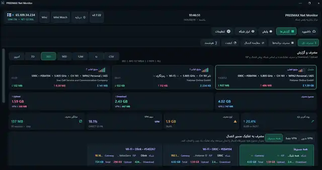
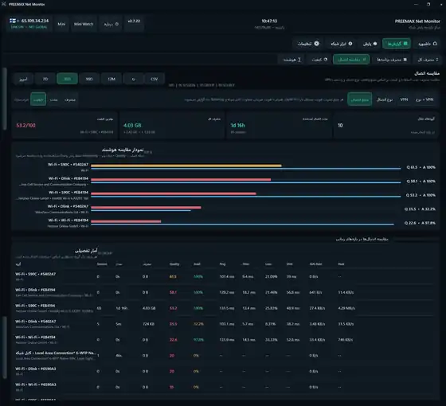
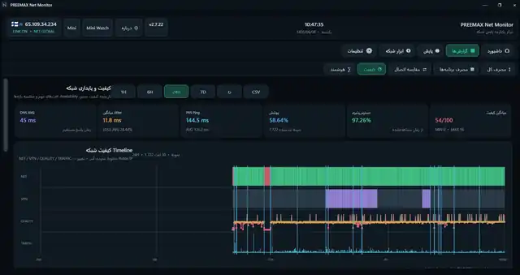
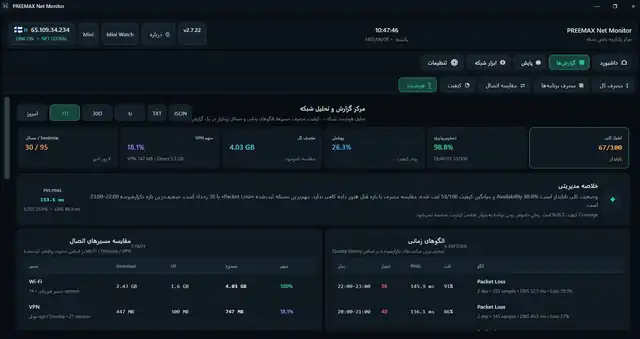
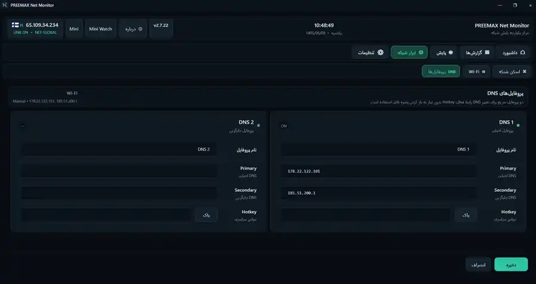

# PREEMAX NetMonitor

<p align="center">
  <strong>مانیتورینگ، گزارش‌گیری و عیب‌یابی شبکه برای Windows</strong>
</p>

<p align="center">
  
  
  
  
</p>

**PREEMAX NetMonitor** یک نرم‌افزار یکپارچه برای مانیتورینگ شبکه، ثبت مصرف اینترنت، بررسی کیفیت اتصال، کنترل DNS و VPN، مانیتورینگ سایت‌ها و سرویس‌ها و نگهداری تاریخچه اتصال در Windows است.

هدف برنامه فقط نمایش سرعت لحظه‌ای نیست؛ NetMonitor برای **ثبت تاریخچه، تفکیک مصرف، مقایسه اتصال‌ها، تشخیص تغییرات، هشدار و گزارش‌گیری در طول زمان** طراحی شده است.

> **Publisher:** PREEMAX / ماناکاوش  
> **Website:** https://preemax.ir

---

# نسخه جدید 2.7.31 — مدیریت سریع DNS و شکن

نسخه `2.7.31` قابلیت مدیریت سریع DNS و سرویس **شکن** را به شکل یکپارچه به برنامه اضافه می‌کند. کاربر می‌تواند بدون ورود مداوم به تنظیمات، از کارت شناور و System Tray بین پروفایل‌های DNS، شکن رایگان، شکن حرفه‌ای و حالت Automatic جابه‌جا شود.

<p align="center">
  
</p>

کارت شناور شکن در یک نوار فشرده وضعیت فعلی را نشان می‌دهد و امکان سوییچ سریع بین موارد زیر را فراهم می‌کند:

- `D1`
- `D2`
- `Shecan Free`
- `Shecan Pro`
- `Automatic / DHCP`

در هر لحظه فقط **یک منبع DNS** مالک تنظیم DNS سیستم است. این معماری از فعال شدن هم‌زمان چند DNS و تداخل بین DNS Profiles و شکن جلوگیری می‌کند.

### کنترل سریع و وضعیت

- روشن/خاموش کردن سریع DNS از System Tray
- نمایش/مخفی کردن Mini Watch از Tray
- نمایش/مخفی کردن کارت شناور شکن از Tray
- Chip رنگی وضعیت کنار کنترل‌های سریع
- Indicator اختصاصی DNS روی آیکن Tray فقط زمانی که یک DNS فعال است
- سبز: DNS فعال و پاسخ‌گو
- نارنجی: در حال اعمال یا بررسی
- قرمز: خطا یا عدم پاسخ
- بدون Indicator: حالت Automatic / DHCP یا نبود DNS فعال
- Tooltip توسعه‌یافته برای نمایش NET، VPN، DNS فعال و Public IP

### Shecan Pro و اعلام IP

در حالت Shecan Pro امکان اعلام Public IP به سرویس حرفه‌ای وجود دارد. در صورت فعال بودن گزینه مربوطه، بعد از تشخیص تغییر Public IP برنامه حدود 10 ثانیه صبر می‌کند و IP جدید را یک بار اعلام می‌کند؛ بنابراین دیگر نیازی به ارسال دوره‌ای ثابت هر چند دقیقه نیست.

**Shecan Core:** `1.2.0`

[مشاهده Release 2.7.31](https://github.com/preemax/PREEMAX-NetMonitor/releases/tag/v2.7.31)

---

# تصاویر واقعی برنامه

> تصاویر این بخش از خود PREEMAX NetMonitor تهیه شده‌اند و برای معرفی رابط واقعی برنامه استفاده می‌شوند.

## مصرف اینترنت و تفکیک مسیر اتصال

<p align="center">
  
</p>

Download، Upload و مجموع مصرف در بازه‌های زمانی مختلف ثبت می‌شوند و گزارش‌ها را می‌توان بر اساس **VPN روشن/خاموش، نوع اتصال و منبع اتصال** تفکیک کرد.

NetMonitor اتصال‌هایی مانند `Wi-Fi`، `Ethernet`، اینترنت موبایل از طریق `USB Tethering` و سایر واسط‌های شبکه را از هم جدا نگه می‌دارد. در Wi-Fi نیز SSID و اطلاعاتی مانند Band و Channel در تشخیص و گزارش اتصال استفاده می‌شوند.

---

## مصرف اینترنت برنامه‌ها و Processها

<p align="center">
  
</p>

برای هر برنامه یا Process می‌توان Download، Upload، مجموع مصرف، مصرف VPN، مصرف Direct، نوع اتصال و منبع اتصال را بررسی کرد.

ثبت مصرف برنامه‌ها در پس‌زمینه ادامه دارد و مستقل از باز بودن صفحه گزارش است.

---

## مقایسه اتصال‌ها و منابع اینترنت

<p align="center">
  
</p>

اتصال‌های مختلف را می‌توان از نظر مصرف، مدت استفاده و کیفیت مقایسه کرد؛ برای مثال Wi-Fi خانه و محل کار، Wi-Fi و Ethernet، اینترنت مودم و USB Tethering یا اتصال Direct و VPN.

---

## کیفیت و پایداری شبکه

<p align="center">
  
</p>

شاخص‌هایی مانند `Ping`، `Jitter`، `Packet Loss`، DNS Response، Availability و رخدادهای قطع یا افت کیفیت در طول زمان ثبت می‌شوند و روی Timeline قابل بررسی هستند.

---

## مرکز گزارش و تحلیل شبکه

<p align="center">
  
</p>

گزارش‌های تاریخی برای بررسی روند مصرف، کیفیت مسیرها، الگوهای زمانی، رخدادها و مقایسه ISPها در بازه‌های هفتگی و ماهانه در نظر گرفته شده‌اند.

---

## مانیتورینگ سایت‌ها و سرویس‌ها

<p align="center">
  
</p>

Website Monitor برای پایش مداوم سایت‌ها و سرویس‌های تعریف‌شده طراحی شده است. برای هر Target می‌توان URL، Interval، Timeout، Failure Threshold، Slow Response Threshold و Status Code مورد انتظار را تعریف کرد.

---

## DNS Profiles

<p align="center">
  
</p>

دو پروفایل DNS قابل تعریف است. هر پروفایل می‌تواند Primary و Secondary DNS داشته باشد و از طریق صفحه اصلی، Mini Watch، Hotkey یا System Tray فعال شود.

اگر D1 یا D2 مقدار معتبر نداشته باشند، در کنترل سریع غیرفعال می‌شوند و Tooltip اعلام می‌کند که مقداری تنظیم نشده است.

---

# قابلیت‌های اصلی

- ثبت مصرف Download / Upload / Total در طول زمان
- تفکیک مصرف با VPN و بدون VPN
- تفکیک مصرف بر اساس Wi-Fi / Ethernet / USB Tethering / Bluetooth
- تفکیک مصرف بر اساس SSID یا Connection Source
- گزارش‌های روزانه، هفتگی، ماهانه و بازه‌های 7D / 30D / 90D / 12M
- خروجی CSV در بخش‌های گزارش
- ثبت مصرف اینترنت هر برنامه و Process
- مشخص شدن سهم VPN و Direct برای هر برنامه
- رصد Public IP و Location تقریبی اتصال
- ثبت و هشدار تغییر IP یا Location
- تشخیص وضعیت Global Internet / Local / Intranet / Offline
- پایش Ping، Jitter، Packet Loss، DNS Response و Availability
- مقایسه کیفیت اتصال‌ها و ISPهای مختلف
- Website / Service Monitor
- Network Scan برای دستگاه‌های شبکه متصل
- Wi-Fi Scan برای SSID، BSSID، Channel، Band، RSSI و Security
- Mini Watch شناور
- کارت شناور سریع شکن
- دو DNS Profile مستقل
- Shecan Free و Shecan Pro
- Single-Owner DNS برای جلوگیری از تداخل
- DNS Quick Switch از Tray و Mini Watch
- Hotkey برای DNS Profiles
- اعلام خودکار IP پس از تغییر در Shecan Pro
- System Tray با کنترل‌های سریع و Indicator وضعیت DNS
- هشدارهای قابل شخصی‌سازی برای رخدادهای شبکه

---

# دانلود Windows

### نسخه فعلی: `2.7.31`

[**دانلود Installer برای Windows x64**](https://github.com/preemax/PREEMAX-NetMonitor/releases/download/v2.7.31/PREEMAX_NetMonitor_Setup_2.7.31_win-x64.exe)

[**دانلود نسخه Portable برای Windows x64**](https://github.com/preemax/PREEMAX-NetMonitor/releases/download/v2.7.31/PREEMAX_NetMonitor_2.7.31_Portable_win-x64.zip)

[مشاهده صفحه Release و توضیحات نسخه](https://github.com/preemax/PREEMAX-NetMonitor/releases/tag/v2.7.31)

- سیستم‌عامل: Windows 10 / Windows 11
- معماری: x64
- نوع انتشار: Pre-release
- Installer استاندارد Windows
- نسخه Portable برای اجرای بدون نصب

> برای امنیت، برنامه را فقط از **GitHub Releases رسمی PREEMAX** یا وب‌سایت رسمی `preemax.ir` دریافت کنید.

---

# بررسی اصالت فایل Release

Release رسمی `2.7.31` همراه فایل‌های زیر منتشر شده است:

- `SHA256SUMS.txt`
- `RELEASE_MANIFEST.json`

SHA-256 فایل Installer:

```text
f16d01ec561c042225d574f182c43c446ddfd47d3ff47618ad148995d7c8e9e3
```

SHA-256 نسخه Portable:

```text
9848f7bbf9884575fbcc75074d5853836ff1bd35050f91c39b4a02652fcb47cb
```

---

# حریم خصوصی

داده‌های مانیتورینگ و گزارش‌های برنامه به‌صورت محلی نگهداری می‌شوند. برای قابلیت‌هایی که ذاتاً نیاز به سرویس اینترنتی دارند، مانند بررسی Public IP، Location تقریبی، Update یا سرویس‌های مانیتورینگ تعریف‌شده، ارتباط شبکه انجام می‌شود.

---

# پشتیبانی

- Website: https://preemax.ir
- Product: PREEMAX NetMonitor
- Publisher: PREEMAX / ماناکاوش
- GitHub Releases: https://github.com/preemax/PREEMAX-NetMonitor/releases

---

Copyright © PREEMAX / Manakavosh. All rights reserved.
